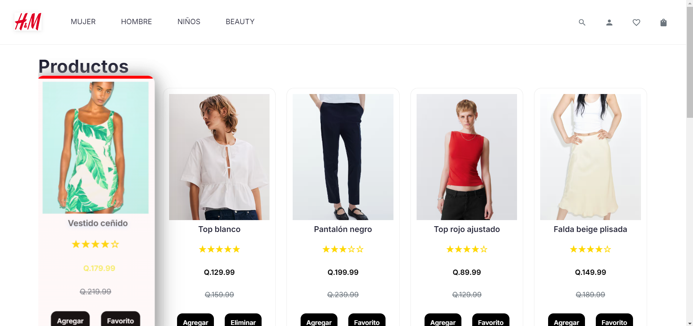

# E-Commerce H&M

Este proyecto es una tienda en línea desarrollada con React y Vite, inspirada en el estilo de plataformas como H&M. Incluye funciones como carrito de compras, sistema de favoritos, visualización de productos, reseñas, precios con descuento y una navegación ágil. La estructura del código sigue buenas prácticas de diseño y se organiza de forma modular para facilitar su mantenimiento y escalabilidad.

## Tecnologías utilizadas

- React 19
- Vite
- Tailwind CSS
- React Router DOM
- React Icons
- ESLint
- Jest (para pruebas)
- Storybook (opcional)

## Estructura del proyecto

```
ecommerce-hm/
├── public/
├── src/
│   ├── assets/
│   ├── components/
│   ├── context/
│   ├── hooks/
│   ├── pages/
│   ├── App.jsx
│   └── main.jsx
├── .eslintrc o eslint.config.js
├── package.json
├── README.md
└── vite.config.js
```

## Instalación y ejecución

1. Clona el repositorio:

```
git clone https://github.com/dils1809/ecommerce-hm.git
cd ecommerce-hm
```

2. Instala las dependencias:

```
npm install
```

3. Ejecuta el proyecto:

```
npm run dev
```

## Scripts disponibles

| Comando           | Descripción                                |
|-------------------|--------------------------------------------|
| `npm run dev`     | Inicia el servidor de desarrollo            |
| `npm run build`   | Genera la versión de producción             |
| `npm run lint`    | Ejecuta ESLint para revisar el código       |
| `npm run test`    | Corre las pruebas (Jest, mínimo configurado) |
| `npm run preview` | Previsualiza el build                       |

## Funcionalidades implementadas

- Vista de productos con nombre, imagen, precio, estrellas y descuento.
- Modal con detalle del producto y botones de agregar y favoritos.
- Carrito funcional con límite de 9 unidades por producto.
- Sistema de favoritos con useRef (historial de likes).
- Recomendaciones inteligentes usando useMemo.
- Filtrado por categoría.
- Descuentos aleatorios y precio anterior tachado.
- Diseño responsivo y animaciones CSS personalizadas.

## Captura



## Autoría

Proyecto desarrollado por Dilary Cruz como parte de los entregables académicos del curso.

Gracias por visitar.
